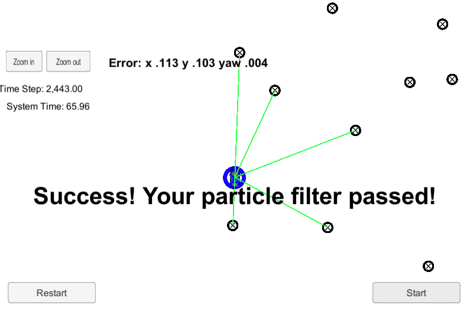

# Kidnapped Vehicle Project
## Background
This project implements a Particle Filter applied to a Kidnapped robot(car) problem. In this project I have implemented a 2 dimensional particle filter in C++. The particle filter is given a map and some initial localization information. At each time step the filter will also get observation and control data.

## Project Goal
The goal is to predict the location of vehicle (robot) after being kidnap by utilizing Particle Filter program in C++. The error between ground truth location of robot and the predicted location should be minimal. Time constrain performance is within 100 seconds while maintaining minimal error. The data consist of a noisy measurement from GPS sensor was received and used to initialize the position of vehicle. This measurement included the x coordinate, y coordinate and the theta (orientation) of vehicle in radian. 

## Dependencies
The project has the following dependencies:

- cmake >= 3.5
- make >= 4.1
- gcc/g++ >= 5.4
- [Simulator](https://github.com/udacity/self-driving-car-sim)

## Build Instruction
- Clone starter files on this [repository](https://github.com/udacity/CarND-Kidnapped-Vehicle-Project)
- On the repo directory create build directory : "mkdir build".
- Enter "build" directory: "cd build".
- Compile the code : "cmake .. && make".
- Run the code: "./particle_filter ". This action open TCP port : 4567.
- Start simulator to connect to listening port.
Choose "Project 3 Kidnap Vehicle". Press "Start" button to run simulator. You should see "Connected!!!" message on terminal.

## Result
The algorithm able to maintain time constrain less than 100s with 100 particles setting.

